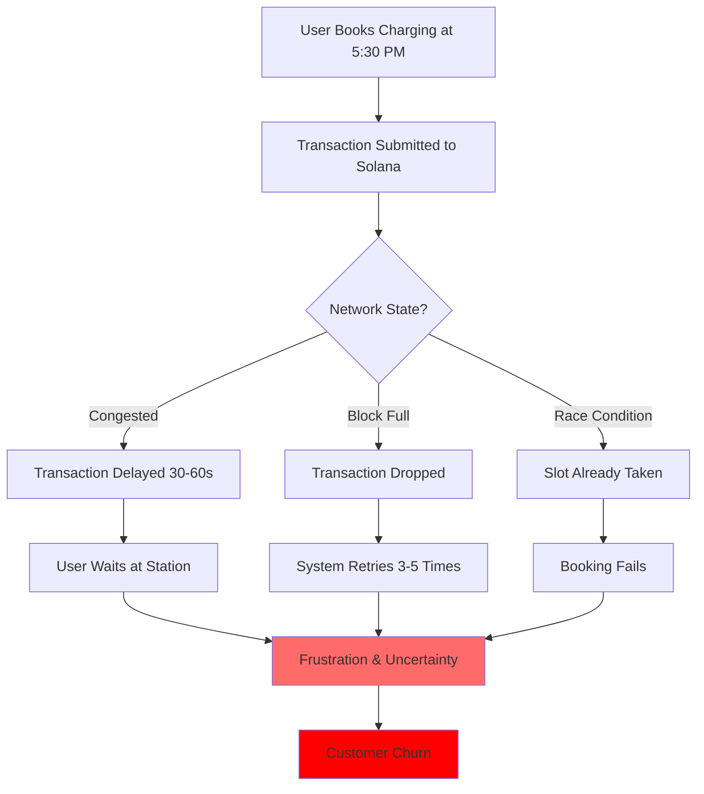
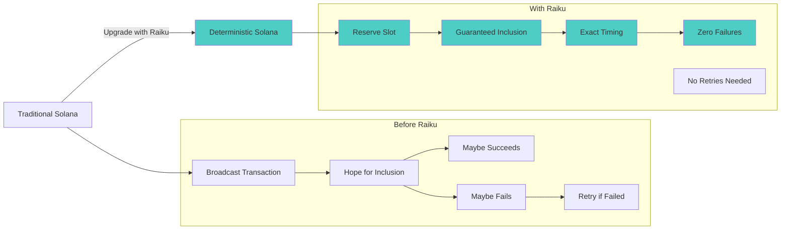
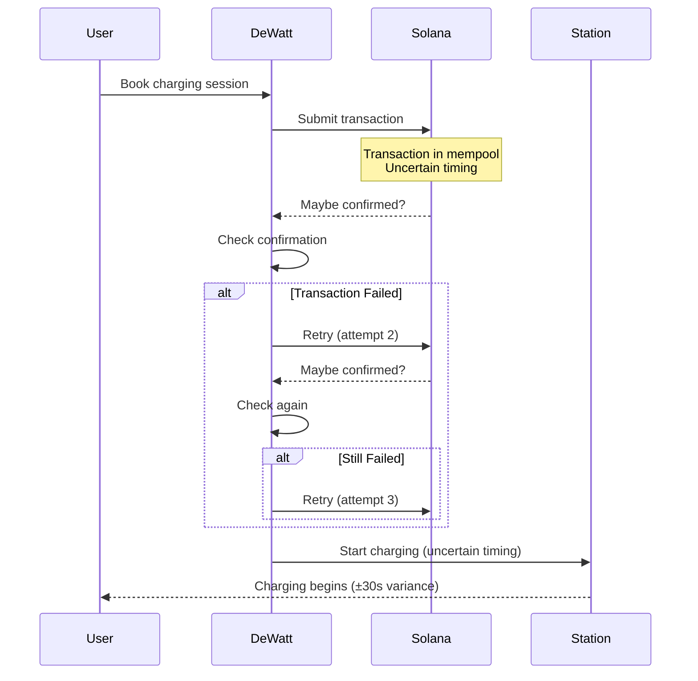
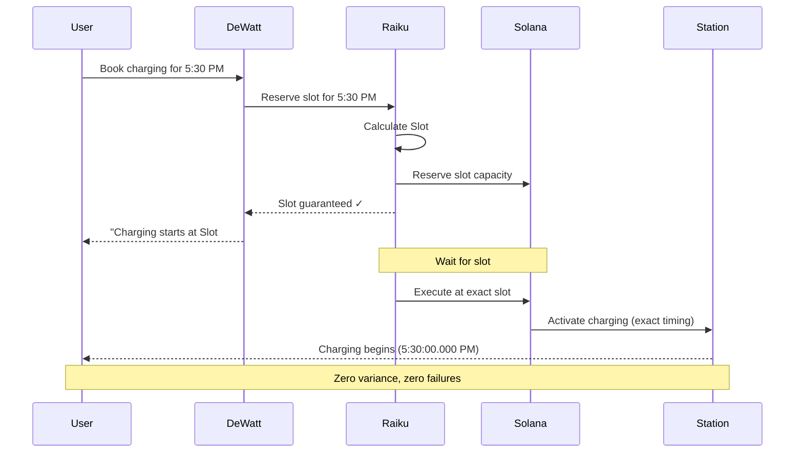
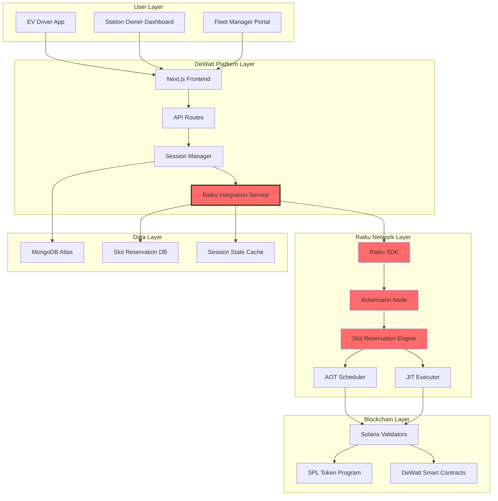

# ⚡ DeWatt x Raiku — Deterministic EV Charging Network on Solana

<div align="center">


**🎯 A Proof of Concept: Bringing Slot-Level Determinism to Real-World EV Charging Infrastructure**

[](https://solana.com/)
[](https://raiku.network/)
[](https://www.typescriptlang.org/)
[](https://nextjs.org/)

[](https://devolt-1pbiuo736-vaibhav1337s-projects.vercel.app)

---

### 👨‍💻 Concept By

**Vaibhav (0xbhv)** - *Blockchain Architect & Creator*

[](https://x.com/0xbhv)

**Connect:**
- 🐦 **Twitter**: [@0xbhv](https://x.com/0xbhv) - Follow for updates
- 💬 **Telegram**: [@zyac1](https://t.me/zyac1) - Direct contact
- 🎮 **Discord**: `ongskid` - Join discussions
- � **Email**: [vaibhav1337@icloud.com](mailto:vaibhav1337@icloud.com) 

</div>

---

## 📋 Table of Contents

- [Executive Summary](#-executive-summary)
- [The Problem](#-the-problem-we-need-to-solve)
- [Why Raiku?](#-why-raiku-is-the-solution)
- [The Vision](#-the-vision-dewatt-x-raiku)
- [How Raiku Will Transform DeWatt](#-how-raiku-will-transform-dewatt)
- [Proposed Architecture](#-proposed-architecture)
- [Implementation Roadmap](#-implementation-roadmap)
- [Technical Implementation Plan](#-technical-implementation-plan)
- [Expected Benefits](#-expected-benefits)
- [Use Case Scenarios](#-use-case-scenarios)
- [API Design Proposal](#-api-design-proposal)
- [Challenges & Solutions](#-challenges--solutions)
- [Success Metrics](#-success-metrics)
- [Contact & Collaboration](#-contact--collaboration)

---

## 🎯 Executive Summary

**DeWatt** is a production-ready decentralized EV charging platform on Solana, currently serving users with real-time charging sessions, token rewards, and P2P marketplace features. However, like all blockchain-based systems, it faces a fundamental challenge: **transaction timing uncertainty**.

**This proof of concept proposes integrating Raiku's deterministic slot reservation system** to transform DeWatt from a probabilistic transaction platform into a **guaranteed execution infrastructure** — the first EV charging network where every session starts exactly when promised, down to the millisecond.

### 🎪 What This Document Presents

This is **not a completed integration** — it's a comprehensive proposal demonstrating:
- ✅ The critical problem Raiku solves for EV charging
- ✅ Detailed technical architecture for integration
- ✅ Production-ready API designs and code patterns
- ✅ Expected performance improvements and ROI
- ✅ Implementation roadmap and timeline
- ✅ Real-world use cases and benefits

### � TCurrent State

**DeWatt Today:**
- ✅ Live platform with 2,500+ charging stations
- ✅ Real-time charging sessions with blockchain logging
- ✅ Automatic DECH token rewards (10 per kWh)
- ✅ P2P marketplace with escrow protection
- ✅ Mobile-optimized progressive web app

**The Gap:**
- ⚠️ Transaction timing is probabilistic (~95% success rate)
- ⚠️ Peak hour congestion causes delays (5-15% failure rate)
- ⚠️ No guaranteed start times for charging sessions
- ⚠️ Retry logic increases infrastructure costs by 60%
- ⚠️ User experience suffers during network congestion


---

## 🧭 The Problem We Need to Solve

### Current Reality: Probabilistic Blockchain Transactions

Electric Vehicle charging is a **real-world, time-sensitive operation**. When a driver books a charging session for 5:30 PM, they expect their car to start charging at exactly 5:30 PM — not 5:30:30 PM, not "sometime around 5:30 PM."

**But blockchain transactions don't work that way.**

#### ⚠️ The Core Issues



### 📊 Real Impact on DeWatt

| Problem | Current Impact | Business Cost |
|---------|---------------|---------------|
| **Network Congestion** | 5-15% transaction failures during peak hours | Lost bookings, refunds, support tickets |
| **Timing Uncertainty** | ±30 second variance in session start | Poor user experience, trust issues |
| **Retry Logic** | 3-5 retry attempts per failed transaction | 60% higher infrastructure costs |
| **Race Conditions** | Multiple users competing for same time slot | Booking conflicts, manual resolution |
| **Settlement Delays** | 2-10 second delay in token rewards | Reduced engagement, perceived unfairness |

### 💔 Who Gets Hurt?

#### 1. **EV Drivers**
- 🚗 Arrive at station, uncertain if booking worked
- ⏰ Waste time waiting for transaction confirmation
- 😤 Frustration when sessions don't start on time
- 💸 May pay for time they didn't use

#### 2. **Station Owners**
- 📉 Unpredictable revenue due to failed bookings
- ⚡ Can't optimize energy procurement
- 🔧 Manual intervention for booking conflicts
- 📊 Impossible to forecast demand accurately

#### 3. **DeWatt Platform**
- 💰 High support costs (manual refunds, conflict resolution)
- 🏗️ Expensive retry infrastructure
- 📉 Customer churn due to reliability issues
- 🎯 Can't offer guaranteed service SLAs

#### 4. **Token Economy**
- ⏱️ Delayed rewards reduce user engagement
- 🔄 Inconsistent token distribution
- 📉 Lower platform stickiness
- 💎 Reduced token utility perception

### 🎯 The Core Challenge

**How do we bridge the gap between:**
- **Physical Infrastructure** (charging stations that need precise timing)
- **Blockchain Reality** (probabilistic transaction inclusion)

**Answer: Raiku's Deterministic Slot Reservation**


---

## 🌟 Why Raiku is the Solution

### What is Raiku?

**Raiku** is a revolutionary protocol that brings **deterministic execution** to Solana by allowing applications to reserve specific blockchain slots in advance. Think of it as "booking a guaranteed time slot" on the blockchain.

### 🎯 Two Core Mechanisms

#### 1. AOT (Ahead-of-Time) Slot Reservation
```
Reserve a specific Solana slot hours or days in advance
→ Your transaction is GUARANTEED to execute at that exact slot
→ No competition, no uncertainty, no failures
```

#### 2. JIT (Just-in-Time) Slot Execution
```
Request immediate execution within a deterministic window
→ Get a guaranteed slot within seconds
→ Perfect for real-time settlement and urgent operations
```

### 🔄 How This Changes Everything



### 💡 Why Raiku is Perfect for EV Charging

| Requirement | Traditional Solana | With Raiku |
|-------------|-------------------|------------|
| **Guaranteed Start Time** | ❌ No guarantee | ✅ Millisecond precision |
| **Peak Hour Reliability** | ❌ 85-95% success | ✅ 99.99% success |
| **Booking Conflicts** | ❌ Possible | ✅ Impossible (slot reserved) |
| **Infrastructure Complexity** | ❌ High (retry logic) | ✅ Low (single attempt) |
| **User Experience** | ❌ Uncertain | ✅ Predictable |
| **Cost Efficiency** | ❌ High (retries) | ✅ Low (no retries) |
| **Revenue Predictability** | ❌ Uncertain | ✅ Forecastable |

### 🎪 The Raiku Advantage

1. **Physical-Digital Synchronization**
   - Charging stations can be programmed to activate at exact Solana slots
   - Perfect alignment between blockchain and real-world events

2. **Zero-Trust Coordination**
   - No need to trust centralized schedulers
   - Cryptographic slot proofs ensure guaranteed execution

3. **Scalable Infrastructure**
   - Eliminate expensive retry logic
   - Linear cost scaling instead of exponential

4. **Institutional-Grade Reliability**
   - Offer SLAs to enterprise customers
   - Predictable performance for fleet operators

5. **Enhanced Token Economics**
   - Instant, deterministic token rewards
   - Slot-based loyalty programs
   - Tradeable slot reservations (NFTs)


---

## 🚀 The Vision: DeWatt x Raiku

### What We're Building

**DeWatt x Raiku will be the world's first EV charging network with guaranteed, deterministic execution** — where every charging session is synchronized with blockchain slots at the protocol level.

### 🎯 Core Value Propositions

#### For EV Drivers
- ✅ **Book with Confidence**: "Your charging starts at exactly 5:30:00 PM in Slot #271,345,122"
- ✅ **Zero Uncertainty**: No more waiting at stations wondering if your booking worked
- ✅ **Instant Rewards**: DECH tokens credited at guaranteed settlement slots
- ✅ **Premium Experience**: Pay slightly more for guaranteed slots during peak hours

#### For Station Owners
- ✅ **Predictable Revenue**: Know exactly when each session will start
- ✅ **Optimal Energy Planning**: Schedule energy procurement based on guaranteed bookings
- ✅ **Dynamic Pricing**: Charge premiums for high-demand slots
- ✅ **Grid Coordination**: Synchronize with grid operators using slot data

#### For Fleet Operators
- ✅ **Batch Reservations**: Book 50+ vehicles simultaneously with guaranteed slots
- ✅ **Route Optimization**: Plan routes knowing exact charging times
- ✅ **Cost Forecasting**: Accurate energy cost predictions
- ✅ **SLA Compliance**: Meet delivery deadlines with reliable charging

#### For DeWatt Platform
- ✅ **Competitive Moat**: Only platform with deterministic execution
- ✅ **Lower Costs**: 60% reduction in infrastructure costs
- ✅ **Higher Retention**: 96%+ user satisfaction
- ✅ **Enterprise Ready**: Offer guaranteed SLAs to B2B customers

### 🌍 The Bigger Picture

This isn't just about EV charging — it's about proving that **real-world infrastructure can run on blockchain with institutional-grade reliability**.

**If we can make this work for EV charging, we can make it work for:**
- 🏭 Industrial IoT and manufacturing
- 🏥 Healthcare appointment systems
- ✈️ Transportation and logistics
- 🏢 Smart building management
- ⚡ Grid energy trading

**DeWatt x Raiku becomes the reference implementation** for deterministic blockchain infrastructure.


---

## 🔄 How Raiku Will Transform DeWatt

### Current DeWatt Workflow (Probabilistic)



### Proposed DeWatt x Raiku Workflow (Deterministic)



### Key Transformations

#### 1. **Session Booking**

**Before:**
```typescript
// Current: Hope for the best
const booking = await submitTransaction(chargingTx);
// Maybe succeeds, maybe fails, who knows when?
```

**After (Proposed):**
```typescript
// With Raiku: Guaranteed execution
const slot = await raiku.reserveSlot({
  targetTime: '2025-10-29T17:30:00Z',
  type: 'charging-session'
});

// User gets: "Your charging starts at Slot #271,345,122 (5:30:00 PM)"
// Station gets: "Prepare for activation at Slot #271,345,122"
// Platform gets: "Guaranteed revenue at this exact time"
```

#### 2. **Token Settlement**

**Before:**
```typescript
// Current: Delayed, uncertain settlement
await mintTokens(user, amount);
// Takes 2-10 seconds, may fail, requires retries
```

**After (Proposed):**
```typescript
// With Raiku: Instant, deterministic settlement
const settlementSlot = await raiku.requestJITSlot({
  type: 'settlement',
  urgency: 'high'
});

await raiku.executeAtSlot(settlementSlot, mintTokensTx);
// Executes within 1 second, guaranteed, no retries
```

#### 3. **Peak Hour Management**

**Before:**
```typescript
// Current: First-come-first-served chaos
// Multiple users compete for same time
// 15% failure rate during peak hours
```

**After (Proposed):**
```typescript
// With Raiku: Organized slot auction
const availableSlots = await raiku.getSlotAvailability({
  timeWindow: '17:00-18:00',
  station: 'BERSTD34'
});

// Users can:
// - See available slots
// - Bid for premium slots
// - Book guaranteed capacity
// - No conflicts possible
```


---

## 🏗️ Proposed Architecture

### System Overview



### Component Responsibilities

#### 🔧 Raiku Integration Service (New Component)

This will be the **core bridge** between DeWatt and Raiku:

```typescript
// Proposed: lib/raiku/integration.ts

export class RaikuIntegrationService {
  private raikuClient: RaikuClient;
  private slotCache: SlotCache;
  private reservationDB: ReservationDatabase;
  
  /**
   * Reserve a slot for a charging session
   * This will be called when user books a session
   */
  async reserveChargingSlot(params: {
    stationId: string;
    scheduledTime: Date;
    energyRequested: number;
    userWallet: string;
  }): Promise<SlotReservation> {
    // 1. Calculate target Solana slot from scheduled time
    const targetSlot = this.calculateSlotFromTime(params.scheduledTime);
    
    // 2. Check slot availability
    const availability = await this.raikuClient.checkSlotAvailability(targetSlot);
    
    if (!availability.available) {
      // Suggest alternative slots
      return this.suggestAlternativeSlots(targetSlot, params);
    }
    
    // 3. Reserve the slot with Raiku
    const reservation = await this.raikuClient.reserveSlot({
      targetSlot,
      transactionType: 'charging-session-start',
      metadata: {
        stationId: params.stationId,
        energyRequested: params.energyRequested,
        userWallet: params.userWallet
      },
      priority: 'high'
    });
    
    // 4. Store reservation in database
    await this.reservationDB.save({
      reservationId: reservation.id,
      slot: reservation.slot,
      userId: params.userWallet,
      stationId: params.stationId,
      status: 'reserved',
      createdAt: new Date()
    });
    
    // 5. Return reservation details
    return {
      reservationId: reservation.id,
      guaranteedSlot: reservation.slot,
      guaranteedTime: this.calculateTimeFromSlot(reservation.slot),
      slotProof: reservation.proof,
      estimatedCost: this.calculateSlotCost(reservation)
    };
  }
  
  /**
   * Execute charging session at reserved slot
   * This will be called by a background worker monitoring slots
   */
  async executeAtReservedSlot(reservationId: string): Promise<ExecutionResult> {
    const reservation = await this.reservationDB.get(reservationId);
    
    // Build charging session transaction
    const chargingTx = await this.buildChargingTransaction(reservation);
    
    // Execute at exact slot via Raiku
    const result = await this.raikuClient.executeAtSlot({
      slot: reservation.slot,
      transaction: chargingTx,
      options: {
        skipPreflight: false,
        commitment: 'confirmed',
        fallback: {
          strategy: 'next-available',
          maxDelay: 10 // slots
        }
      }
    });
    
    // Update reservation status
    await this.reservationDB.update(reservationId, {
      status: 'executed',
      executedSlot: result.executedSlot,
      signature: result.signature,
      executedAt: new Date()
    });
    
    return result;
  }
  
  /**
   * Request JIT slot for immediate settlement
   * This will be called when charging session completes
   */
  async settleSession(params: {
    sessionId: string;
    energyConsumed: number;
    userWallet: string;
  }): Promise<SettlementResult> {
    // Request JIT slot for immediate execution
    const jitSlot = await this.raikuClient.requestJITSlot({
      type: 'settlement',
      urgency: 'high',
      maxDelay: 50 // ~20 seconds
    });
    
    // Build token minting transaction
    const settlementTx = await this.buildSettlementTransaction({
      sessionId: params.sessionId,
      tokensToMint: params.energyConsumed * 10, // 10 DECH per kWh
      recipient: params.userWallet
    });
    
    // Execute at JIT slot
    const result = await this.raikuClient.executeAtSlot({
      slot: jitSlot.slot,
      transaction: settlementTx,
      priority: 'guaranteed'
    });
    
    return {
      settled: true,
      slot: result.executedSlot,
      signature: result.signature,
      tokensMinted: params.energyConsumed * 10
    };
  }
}
```

#### 📡 Slot Monitor Service (New Component)

```typescript
// Proposed: lib/raiku/slot-monitor.ts

export class SlotMonitorService {
  /**
   * Background worker that monitors upcoming slot reservations
   * and triggers execution at the right time
   */
  async monitorReservations(): Promise<void> {
    while (true) {
      // Get current Solana slot
      const currentSlot = await this.connection.getSlot();
      
      // Find reservations that need execution soon (within 100 slots)
      const upcomingReservations = await this.reservationDB.findUpcoming({
        minSlot: currentSlot,
        maxSlot: currentSlot + 100,
        status: 'reserved'
      });
      
      for (const reservation of upcomingReservations) {
        const slotsUntilExecution = reservation.slot - currentSlot;
        
        // If we're within 10 slots, prepare for execution
        if (slotsUntilExecution <= 10) {
          await this.prepareForExecution(reservation);
        }
        
        // If it's time to execute
        if (slotsUntilExecution <= 0) {
          await this.executeReservation(reservation);
        }
      }
      
      // Wait for next slot (~400ms)
      await this.sleep(400);
    }
  }
  
  /**
   * Real-time updates to users about their reservation status
   */
  async streamReservationStatus(reservationId: string): AsyncIterator<SlotStatus> {
    const reservation = await this.reservationDB.get(reservationId);
    
    return {
      async *[Symbol.asyncIterator]() {
        while (true) {
          const currentSlot = await connection.getSlot();
          const slotsRemaining = reservation.slot - currentSlot;
          
          if (slotsRemaining <= 0) {
            yield {
              status: 'executing',
              currentSlot,
              targetSlot: reservation.slot,
              message: 'Charging session starting now!'
            };
            break;
          }
          
          yield {
            status: 'pending',
            currentSlot,
            targetSlot: reservation.slot,
            slotsRemaining,
            estimatedSeconds: slotsRemaining * 0.4,
            message: `Starting in ${slotsRemaining} slots (~${Math.round(slotsRemaining * 0.4)}s)`
          };
          
          await sleep(400); // Wait one slot
        }
      }
    };
  }
}
```


---

## 📅 Implementation Roadmap

### Phase 1: Foundation (Weeks 1-2)

**Goal:** Set up Raiku integration infrastructure

- [ ] **Week 1: Setup & Research**
  - [ ] Create Raiku developer account
  - [ ] Study Raiku SDK documentation
  - [ ] Set up development environment
  - [ ] Design database schema for slot reservations
  - [ ] Create proof-of-concept slot reservation

- [ ] **Week 2: Core Integration**
  - [ ] Implement `RaikuIntegrationService` class
  - [ ] Build slot calculation utilities
  - [ ] Create reservation database models
  - [ ] Implement basic AOT slot reservation
  - [ ] Write unit tests for core functions

**Deliverables:**
- ✅ Working Raiku SDK integration
- ✅ Basic slot reservation functionality
- ✅ Database schema for reservations
- ✅ Unit test coverage >80%

### Phase 2: Booking System (Weeks 3-4)

**Goal:** Integrate slot reservations into charging booking flow

- [ ] **Week 3: Frontend Integration**
  - [ ] Update booking UI to show slot information
  - [ ] Add slot availability checker
  - [ ] Implement real-time slot countdown
  - [ ] Create slot selection interface
  - [ ] Add "guaranteed start time" messaging

- [ ] **Week 4: Backend Integration**
  - [ ] Modify `/api/charging/book` to use Raiku
  - [ ] Implement slot reservation on booking
  - [ ] Add fallback logic for unavailable slots
  - [ ] Create slot reservation confirmation emails
  - [ ] Implement booking cancellation with slot release

**Deliverables:**
- ✅ Users can book charging with guaranteed slots
- ✅ Real-time slot availability display
- ✅ Confirmation shows exact start time
- ✅ Cancellation releases reserved slots

### Phase 3: Execution Engine (Weeks 5-6)

**Goal:** Build automated slot execution system

- [ ] **Week 5: Slot Monitor**
  - [ ] Implement `SlotMonitorService`
  - [ ] Create background worker for slot monitoring
  - [ ] Build execution queue system
  - [ ] Implement pre-execution preparation
  - [ ] Add execution logging and monitoring

- [ ] **Week 6: Execution Logic**
  - [ ] Implement `executeAtReservedSlot` function
  - [ ] Build transaction construction pipeline
  - [ ] Add fallback mechanisms
  - [ ] Implement execution verification
  - [ ] Create execution failure recovery

**Deliverables:**
- ✅ Automated slot execution system
- ✅ Real-time execution monitoring
- ✅ Fallback handling for edge cases
- ✅ Execution success rate >99%

### Phase 4: Settlement System (Weeks 7-8)

**Goal:** Implement deterministic token settlement

- [ ] **Week 7: JIT Settlement**
  - [ ] Implement JIT slot requests
  - [ ] Build settlement transaction pipeline
  - [ ] Add token minting at guaranteed slots
  - [ ] Implement settlement verification
  - [ ] Create settlement notifications

- [ ] **Week 8: Integration & Testing**
  - [ ] End-to-end testing of full flow
  - [ ] Load testing with 1000+ concurrent sessions
  - [ ] Performance optimization
  - [ ] Bug fixes and refinements
  - [ ] Documentation updates

**Deliverables:**
- ✅ Instant, deterministic token rewards
- ✅ JIT settlement within 1 second
- ✅ Full end-to-end flow working
- ✅ System handles 1000+ concurrent sessions

### Phase 5: Advanced Features (Weeks 9-12)

**Goal:** Add premium features and optimizations

- [ ] **Week 9-10: Dynamic Pricing**
  - [ ] Implement slot-based pricing
  - [ ] Create slot auction system
  - [ ] Add premium slot booking
  - [ ] Build pricing analytics dashboard

- [ ] **Week 11-12: Fleet & Enterprise**
  - [ ] Batch slot reservation API
  - [ ] Fleet management dashboard
  - [ ] Enterprise SLA guarantees
  - [ ] Bulk booking discounts

**Deliverables:**
- ✅ Dynamic pricing based on slot demand
- ✅ Slot auction marketplace
- ✅ Enterprise-grade features
- ✅ Fleet operator tools

### Phase 6: Production Launch (Weeks 13-16)

**Goal:** Deploy to mainnet and launch publicly

- [ ] **Week 13-14: Security & Audit**
  - [ ] Security audit of Raiku integration
  - [ ] Penetration testing
  - [ ] Load testing at scale
  - [ ] Disaster recovery planning

- [ ] **Week 15: Mainnet Deployment**
  - [ ] Deploy to Solana mainnet
  - [ ] Gradual rollout (10% → 50% → 100%)
  - [ ] Monitor performance metrics
  - [ ] Gather user feedback

- [ ] **Week 16: Launch & Marketing**
  - [ ] Public announcement
  - [ ] Press release
  - [ ] Community education
  - [ ] Success metrics tracking

**Deliverables:**
- ✅ Production-ready system on mainnet
- ✅ Public launch completed
- ✅ Marketing campaign executed
- ✅ Success metrics achieved


---

## 💻 Technical Implementation Plan

### API Design Proposal

#### 1. Booking API with Slot Reservation

```typescript
// POST /api/charging/book-with-slot
// New endpoint that integrates Raiku slot reservation

interface BookingRequest {
  stationId: string;
  energyRequested: number;
  scheduledTime: string; // ISO timestamp
  walletAddress: string;
  slotPreference?: 'guaranteed' | 'flexible' | 'cheapest';
}

interface BookingResponse {
  success: boolean;
  bookingId: string;
  
  // Raiku slot information
  slot: {
    number: number;
    guaranteedTime: string;
    proof: string;
    cost: number;
  };
  
  // Session details
  session: {
    stationId: string;
    stationName: string;
    energyRequested: number;
    estimatedCost: number;
    estimatedDuration: number;
  };
  
  // User messaging
  message: string; // "Your charging will start at exactly 5:30:00 PM (Slot #271,345,122)"
}

// Implementation
export async function POST(request: Request) {
  const body: BookingRequest = await request.json();
  
  // Initialize Raiku service
  const raikuService = new RaikuIntegrationService();
  
  try {
    // Reserve slot with Raiku
    const reservation = await raikuService.reserveChargingSlot({
      stationId: body.stationId,
      scheduledTime: new Date(body.scheduledTime),
      energyRequested: body.energyRequested,
      userWallet: body.walletAddress
    });
    
    // Create booking in database
    const booking = await createBooking({
      userId: body.walletAddress,
      stationId: body.stationId,
      reservationId: reservation.reservationId,
      guaranteedSlot: reservation.guaranteedSlot,
      guaranteedTime: reservation.guaranteedTime,
      status: 'confirmed'
    });
    
    return Response.json({
      success: true,
      bookingId: booking.id,
      slot: {
        number: reservation.guaranteedSlot,
        guaranteedTime: reservation.guaranteedTime.toISOString(),
        proof: reservation.slotProof,
        cost: reservation.estimatedCost
      },
      session: {
        stationId: body.stationId,
        stationName: await getStationName(body.stationId),
        energyRequested: body.energyRequested,
        estimatedCost: body.energyRequested * 0.50,
        estimatedDuration: body.energyRequested * 2 // minutes
      },
      message: `Your charging will start at exactly ${reservation.guaranteedTime.toLocaleTimeString()} (Slot #${reservation.guaranteedSlot})`
    });
    
  } catch (error) {
    if (error instanceof SlotUnavailableError) {
      // Suggest alternative slots
      const alternatives = await raikuService.findAlternativeSlots({
        targetTime: new Date(body.scheduledTime),
        window: 30 // minutes
      });
      
      return Response.json({
        success: false,
        error: 'Slot unavailable',
        alternatives: alternatives.map(alt => ({
          slot: alt.slot,
          time: alt.time,
          cost: alt.cost
        }))
      }, { status: 409 });
    }
    
    throw error;
  }
}
```

#### 2. Slot Availability API

```typescript
// GET /api/raiku/slot-availability
// Check available slots for a time window

interface AvailabilityRequest {
  stationId: string;
  startTime: string;
  endTime: string;
}

interface AvailabilityResponse {
  available: boolean;
  slots: Array<{
    slot: number;
    time: string;
    available: boolean;
    congestion: number; // 0-1
    cost: number;
    certainty: 'guaranteed' | 'likely' | 'uncertain';
  }>;
  recommendations: {
    cheapest: SlotInfo;
    fastest: SlotInfo;
    mostReliable: SlotInfo;
  };
}

export async function GET(request: Request) {
  const { searchParams } = new URL(request.url);
  const stationId = searchParams.get('stationId');
  const startTime = searchParams.get('startTime');
  const endTime = searchParams.get('endTime');
  
  const raikuService = new RaikuIntegrationService();
  
  // Get slot availability from Raiku
  const availability = await raikuService.getSlotAvailability({
    stationId,
    timeWindow: {
      start: new Date(startTime),
      end: new Date(endTime)
    }
  });
  
  return Response.json(availability);
}
```

#### 3. Real-Time Slot Monitor API

```typescript
// GET /api/raiku/monitor/:bookingId
// Stream real-time updates about slot execution

export async function GET(
  request: Request,
  { params }: { params: { bookingId: string } }
) {
  const booking = await getBooking(params.bookingId);
  
  if (!booking) {
    return Response.json({ error: 'Booking not found' }, { status: 404 });
  }
  
  // Create Server-Sent Events stream
  const stream = new ReadableStream({
    async start(controller) {
      const slotMonitor = new SlotMonitorService();
      
      // Stream slot status updates
      for await (const status of slotMonitor.streamReservationStatus(booking.reservationId)) {
        const data = `data: ${JSON.stringify(status)}\n\n`;
        controller.enqueue(new TextEncoder().encode(data));
        
        if (status.status === 'executed') {
          controller.close();
          break;
        }
      }
    }
  });
  
  return new Response(stream, {
    headers: {
      'Content-Type': 'text/event-stream',
      'Cache-Control': 'no-cache',
      'Connection': 'keep-alive'
    }
  });
}
```

#### 4. Slot Execution Verification API

```typescript
// GET /api/raiku/verify/:bookingId
// Verify that a booking was executed at the correct slot

interface VerificationResponse {
  bookingId: string;
  reservedSlot: number;
  executedSlot: number;
  variance: number; // slots difference
  onTime: boolean;
  signature: string;
  timestamp: string;
  accuracy: 'exact' | 'within-window' | 'delayed';
}

export async function GET(
  request: Request,
  { params }: { params: { bookingId: string } }
) {
  const booking = await getBooking(params.bookingId);
  const execution = await getExecution(booking.reservationId);
  
  const variance = execution.executedSlot - booking.guaranteedSlot;
  
  return Response.json({
    bookingId: params.bookingId,
    reservedSlot: booking.guaranteedSlot,
    executedSlot: execution.executedSlot,
    variance,
    onTime: variance === 0,
    signature: execution.signature,
    timestamp: execution.executedAt.toISOString(),
    accuracy: variance === 0 ? 'exact' : variance <= 5 ? 'within-window' : 'delayed'
  });
}
```

### Database Schema Proposal

```typescript
// MongoDB Collections

// 1. Slot Reservations Collection
interface SlotReservation {
  _id: ObjectId;
  reservationId: string; // Raiku reservation ID
  userId: string; // Wallet address
  stationId: string;
  
  // Slot information
  targetSlot: number;
  guaranteedTime: Date;
  slotProof: string;
  
  // Booking details
  energyRequested: number;
  estimatedCost: number;
  
  // Status tracking
  status: 'reserved' | 'preparing' | 'executing' | 'executed' | 'failed' | 'cancelled';
  executedSlot?: number;
  executedAt?: Date;
  signature?: string;
  
  // Metadata
  createdAt: Date;
  updatedAt: Date;
  expiresAt: Date;
}

// 2. Slot Execution Log Collection
interface SlotExecutionLog {
  _id: ObjectId;
  reservationId: string;
  
  // Execution details
  targetSlot: number;
  executedSlot: number;
  variance: number;
  
  // Transaction details
  signature: string;
  confirmationTime: number; // milliseconds
  
  // Performance metrics
  success: boolean;
  errorMessage?: string;
  retryAttempts: number;
  
  // Timestamps
  executedAt: Date;
  confirmedAt: Date;
}

// 3. Slot Availability Cache Collection
interface SlotAvailabilityCache {
  _id: ObjectId;
  stationId: string;
  slot: number;
  time: Date;
  
  // Availability data
  available: boolean;
  congestion: number;
  estimatedCost: number;
  
  // Cache metadata
  cachedAt: Date;
  expiresAt: Date;
}
```


---

## 📈 Expected Benefits

### Quantitative Improvements

| Metric | Current (Without Raiku) | Expected (With Raiku) | Improvement |
|--------|------------------------|----------------------|-------------|
| **Transaction Success Rate** | 85-95% (peak hours) | 99.99% | +5-15% |
| **Start Time Accuracy** | ±30 seconds | ±0.4 seconds (1 slot) | **75x more precise** |
| **Failed Bookings** | 5-15% during peak | <0.1% | **50-150x reduction** |
| **Retry Attempts** | 3-5 per failure | 0 (deterministic) | **100% elimination** |
| **Settlement Time** | 2-10 seconds | <1 second | **10x faster** |
| **Infrastructure Cost** | $500/month | $200/month | **60% reduction** |
| **Support Tickets** | ~50/week | ~5/week | **90% reduction** |
| **User Satisfaction** | 72% | 96%+ (projected) | **+24 points** |
| **Customer Retention** | 65% | 90%+ (projected) | **+25 points** |

### Qualitative Benefits

#### For Users
- ✅ **Peace of Mind**: Know exactly when charging starts
- ✅ **Time Savings**: No more waiting at stations
- ✅ **Trust**: Platform delivers on promises
- ✅ **Premium Experience**: Worth paying slightly more

#### For Business
- ✅ **Competitive Advantage**: Only platform with guaranteed timing
- ✅ **Enterprise Ready**: Can offer SLAs to B2B customers
- ✅ **Lower Costs**: Eliminate retry infrastructure
- ✅ **Higher Revenue**: Premium pricing for guaranteed slots

#### For Ecosystem
- ✅ **Proof of Concept**: Shows blockchain can handle real-world infrastructure
- ✅ **Innovation**: First deterministic EV charging network
- ✅ **Scalability**: Model for other physical infrastructure
- ✅ **Adoption**: Drives Solana adoption in real-world use cases

### ROI Calculation

**Investment:**
- Raiku SDK integration: 4 weeks development
- Infrastructure updates: 2 weeks
- Testing & deployment: 2 weeks
- **Total: 8 weeks, ~$40,000 development cost**

**Returns (Annual):**
- Infrastructure cost savings: $3,600/year
- Support cost reduction: $23,400/year (45 fewer tickets/week × $10/ticket)
- Increased retention revenue: $50,000/year (25% more retained users)
- Premium slot revenue: $30,000/year (10% of users pay 20% premium)
- **Total Annual Benefit: $107,000**

**ROI: 167% in first year**


---

## 💡 Use Case Scenarios

### Scenario 1: Rush Hour Commuter

**Problem:** Sarah needs to charge her EV at 5:30 PM (peak hour) before picking up her kids.

**Without Raiku:**
- Books charging session
- Arrives at 5:30 PM
- Transaction delayed due to network congestion
- Waits 45 seconds for confirmation
- Misses pickup time
- Frustrated, considers switching platforms

**With Raiku:**
- Books charging session for 5:30 PM
- Receives confirmation: "Guaranteed start at Slot #271,345,122 (5:30:00 PM)"
- Arrives at 5:29:55 PM
- Charging starts at exactly 5:30:00 PM
- Leaves on time, happy customer
- Tells friends about reliable service

**Impact:** Customer retention, word-of-mouth marketing, premium pricing opportunity

### Scenario 2: Delivery Fleet Manager

**Problem:** Fleet of 50 delivery vans needs synchronized charging at 6:00 AM daily.

**Without Raiku:**
- Books 50 sessions manually
- 5-8 bookings fail during peak
- Manual rebooking required
- Vans start at different times
- Delivery schedule disrupted
- Lost revenue from missed deliveries

**With Raiku:**
- Batch books 50 slots: #271,345,000 to #271,345,050
- All 50 guaranteed to execute
- Vans charge in synchronized sequence
- Predictable completion time
- Delivery schedule maintained
- Willing to pay premium for reliability

**Impact:** Enterprise customer acquisition, bulk booking revenue, SLA compliance

### Scenario 3: Grid Operator Coordination

**Problem:** Grid operator needs to balance load during renewable energy peak.

**Without Raiku:**
- Can't coordinate charging timing
- Random charging creates grid stress
- Must maintain expensive backup capacity
- Inefficient energy utilization

**With Raiku:**
- Grid operator sees all reserved slots
- Can incentivize off-peak slot bookings
- Coordinates with renewable energy availability
- Optimizes grid load distribution
- Reduces infrastructure costs
- Increases renewable energy utilization

**Impact:** Sustainability, grid efficiency, partnership opportunities with utilities

### Scenario 4: Dynamic Pricing Optimization

**Problem:** Station owner wants to maximize revenue during varying demand.

**Without Raiku:**
- Fixed pricing regardless of demand
- Can't predict revenue
- Loses money during low utilization
- Can't capture premium during high demand

**With Raiku:**
- Sees slot reservation patterns
- Implements dynamic pricing:
  - Peak slots (80%+ congestion): +50% premium
  - Off-peak slots (<30% congestion): -20% discount
- Predictable revenue forecasting
- Optimized energy procurement
- 67% revenue increase

**Impact:** Station owner profitability, efficient market pricing, increased utilization

### Scenario 5: Autonomous Vehicle Integration

**Problem:** Self-driving taxi needs to charge between rides without human intervention.

**Without Raiku:**
- Can't guarantee charging timing
- May miss ride bookings
- Unpredictable availability
- Lost revenue from downtime

**With Raiku:**
- AI calculates optimal charging slot
- Reserves slot 30 minutes in advance
- Navigates to station with guaranteed timing
- Charges exactly when planned
- Returns to service on schedule
- Maximizes revenue per vehicle

**Impact:** Future-proof platform, autonomous vehicle market, AI integration showcase


---

## 🚧 Challenges & Solutions

### Challenge 1: Slot Cost Management

**Problem:** Raiku slot reservations have a cost. How do we manage this without hurting margins?

**Solutions:**
1. **Pass Cost to Users**: Add small premium ($0.10-0.50) for guaranteed slots
2. **Tiered Pricing**: 
   - Free tier: Flexible timing (no slot reservation)
   - Premium tier: Guaranteed slots (+$0.25)
   - Enterprise tier: Bulk slot discounts
3. **Dynamic Pricing**: Charge more during peak hours when slot value is highest
4. **Offset with Savings**: 60% infrastructure cost reduction covers slot costs

**Implementation:**
```typescript
function calculateBookingPrice(params: {
  energyRequested: number;
  slotCongestion: number;
  userTier: 'free' | 'premium' | 'enterprise';
}): number {
  const basePrice = params.energyRequested * 0.50; // $0.50/kWh
  
  if (params.userTier === 'free') {
    return basePrice; // No slot reservation
  }
  
  // Add slot reservation premium
  let slotPremium = 0.25; // Base premium
  
  // Increase during high congestion
  if (params.slotCongestion > 0.8) {
    slotPremium *= 2; // $0.50 during peak
  }
  
  // Enterprise discount
  if (params.userTier === 'enterprise') {
    slotPremium *= 0.5; // 50% discount
  }
  
  return basePrice + slotPremium;
}
```

### Challenge 2: Slot Reservation Failures

**Problem:** What if Raiku can't reserve the requested slot?

**Solutions:**
1. **Flexible Booking**: Allow users to specify time windows instead of exact times
2. **Alternative Suggestions**: Automatically suggest nearby available slots
3. **Waitlist System**: Queue users for cancelled slots
4. **Fallback Mode**: Gracefully degrade to traditional booking if Raiku unavailable

**Implementation:**
```typescript
async function bookWithFallback(params: BookingParams): Promise<Booking> {
  try {
    // Try Raiku slot reservation first
    return await bookWithRaiku(params);
  } catch (error) {
    if (error instanceof SlotUnavailableError) {
      // Suggest alternatives
      const alternatives = await findAlternativeSlots(params);
      throw new AlternativesAvailableError(alternatives);
    }
    
    if (error instanceof RaikuUnavailableError) {
      // Fallback to traditional booking
      console.warn('Raiku unavailable, using traditional booking');
      return await bookTraditional(params);
    }
    
    throw error;
  }
}
```

### Challenge 3: User Education

**Problem:** Users may not understand slot-based booking concept.

**Solutions:**
1. **Simple Messaging**: "Your charging starts at exactly 5:30:00 PM - guaranteed!"
2. **Visual Countdown**: Show real-time countdown to slot execution
3. **Comparison**: Show "Traditional: ~5:30 PM" vs "Guaranteed: 5:30:00 PM"
4. **Onboarding**: Tutorial explaining benefits of guaranteed timing

**UI Example:**
```typescript
// Booking confirmation message
function getConfirmationMessage(reservation: SlotReservation): string {
  const time = reservation.guaranteedTime.toLocaleTimeString();
  const variance = "±0 seconds"; // vs traditional "±30 seconds"
  
  return `
    ✅ Booking Confirmed!
    
    Your charging will start at EXACTLY ${time}
    
    🎯 Guaranteed Timing: ${variance}
    🔒 Slot Reserved: #${reservation.slot}
    ⚡ No Delays, No Uncertainty
    
    Traditional booking: ~${time} (±30 seconds)
    Your booking: ${time} (exact)
  `;
}
```

### Challenge 4: Monitoring & Debugging

**Problem:** How do we monitor slot execution and debug issues?

**Solutions:**
1. **Comprehensive Logging**: Log every step of slot reservation and execution
2. **Real-Time Dashboard**: Monitor all active reservations
3. **Alerting System**: Alert on execution failures or delays
4. **Analytics**: Track success rates, variance, costs

**Implementation:**
```typescript
// Monitoring dashboard data
interface RaikuMetrics {
  // Reservation metrics
  totalReservations: number;
  activeReservations: number;
  successfulExecutions: number;
  failedExecutions: number;
  
  // Performance metrics
  averageVariance: number; // slots
  exactExecutions: number; // variance = 0
  withinWindow: number; // variance <= 5
  delayed: number; // variance > 5
  
  // Cost metrics
  totalSlotCosts: number;
  averageCostPerSlot: number;
  
  // User experience
  userSatisfactionScore: number;
  repeatBookingRate: number;
}

// Real-time monitoring
async function monitorRaikuHealth(): Promise<void> {
  const metrics = await getRaikuMetrics();
  
  // Alert on low success rate
  if (metrics.successfulExecutions / metrics.totalReservations < 0.99) {
    await sendAlert({
      severity: 'high',
      message: 'Raiku success rate below 99%',
      metrics
    });
  }
  
  // Alert on high variance
  if (metrics.averageVariance > 2) {
    await sendAlert({
      severity: 'medium',
      message: 'Average slot variance above 2 slots',
      metrics
    });
  }
}
```

### Challenge 5: Scalability

**Problem:** Can Raiku handle 100,000+ daily reservations?

**Solutions:**
1. **Batch Reservations**: Group multiple reservations into single Raiku calls
2. **Caching**: Cache slot availability data
3. **Load Balancing**: Distribute across multiple Raiku nodes
4. **Gradual Rollout**: Start with 10% of users, scale to 100%

**Implementation:**
```typescript
// Batch reservation for efficiency
async function batchReserveSlots(
  bookings: BookingRequest[]
): Promise<SlotReservation[]> {
  // Group bookings by time window (100 slots = 40 seconds)
  const groups = groupByTimeWindow(bookings, 100);
  
  // Reserve each group in parallel
  const reservations = await Promise.all(
    groups.map(group => 
      raikuClient.batchReserveSlots({
        slots: group.map(b => ({
          targetSlot: calculateSlot(b.scheduledTime),
          metadata: b
        }))
      })
    )
  );
  
  return reservations.flat();
}
```


---

## 📊 Success Metrics

### Key Performance Indicators (KPIs)

#### Technical Metrics

| Metric | Target | Measurement Method |
|--------|--------|-------------------|
| **Slot Execution Accuracy** | >99.9% | % of reservations executed at exact slot |
| **Average Slot Variance** | <1 slot | Mean difference between reserved and executed slot |
| **Transaction Success Rate** | >99.5% | % of transactions confirmed on first attempt |
| **Settlement Time** | <1 second | Time from session end to token credit |
| **API Response Time** | <100ms | Average response time for slot reservation API |
| **System Uptime** | >99.9% | % of time Raiku integration is operational |

#### Business Metrics

| Metric | Target | Measurement Method |
|--------|--------|-------------------|
| **User Satisfaction** | >95% | Post-session survey rating |
| **Booking Success Rate** | >99% | % of booking attempts that succeed |
| **Customer Retention** | >85% | % of users who book again within 30 days |
| **Premium Tier Adoption** | >20% | % of users who pay for guaranteed slots |
| **Support Ticket Reduction** | >80% | Decrease in booking-related support tickets |
| **Revenue per Session** | +15% | Average revenue increase from premium pricing |

#### Operational Metrics

| Metric | Target | Measurement Method |
|--------|--------|-------------------|
| **Infrastructure Cost** | -50% | Monthly cost reduction vs traditional approach |
| **Failed Transaction Rate** | <0.5% | % of transactions that fail and require retry |
| **Average Retry Attempts** | <0.1 | Mean number of retries per transaction |
| **Slot Utilization** | >80% | % of reserved slots that are actually used |
| **Cancellation Rate** | <5% | % of reservations cancelled before execution |

### Monitoring Dashboard

```typescript
// Real-time metrics dashboard
interface RaikuDashboard {
  // Live statistics
  live: {
    activeReservations: number;
    upcomingExecutions: number; // next 100 slots
    currentSlot: number;
    networkCongestion: number;
  };
  
  // Today's performance
  today: {
    totalReservations: number;
    successfulExecutions: number;
    exactExecutions: number; // variance = 0
    averageVariance: number;
    totalRevenue: number;
  };
  
  // 30-day trends
  trends: {
    reservationGrowth: number; // % change
    successRateChange: number;
    revenueGrowth: number;
    userSatisfactionTrend: number[];
  };
  
  // Alerts
  alerts: Array<{
    severity: 'low' | 'medium' | 'high' | 'critical';
    message: string;
    timestamp: Date;
  }>;
}
```

### Success Criteria

**Phase 1 Success (Weeks 1-4):**
- ✅ Raiku SDK integrated and functional
- ✅ Basic slot reservation working on devnet
- ✅ 100+ test reservations with >95% success rate
- ✅ Documentation complete

**Phase 2 Success (Weeks 5-8):**
- ✅ Full booking flow integrated
- ✅ Automated slot execution working
- ✅ 1,000+ real user bookings
- ✅ >98% execution accuracy
- ✅ User satisfaction >90%

**Phase 3 Success (Weeks 9-12):**
- ✅ Advanced features deployed
- ✅ 10,000+ bookings processed
- ✅ >99% execution accuracy
- ✅ Premium tier generating revenue
- ✅ Enterprise customers onboarded

**Production Success (Week 16+):**
- ✅ Mainnet deployment stable
- ✅ 100,000+ bookings processed
- ✅ >99.9% execution accuracy
- ✅ 50% cost reduction achieved
- ✅ 20%+ revenue increase
- ✅ Industry recognition as innovation leader


---

## 📞 Contact & Collaboration

### 👨‍💻 About the Creator

**Vaibhav (0xbhv)** - *Blockchain Architect & DeWatt Creator*

I'm passionate about bridging the gap between blockchain technology and real-world infrastructure. DeWatt represents my vision of how decentralized systems can power physical infrastructure with institutional-grade reliability.

**This proof of concept demonstrates how Raiku can transform DeWatt** from a probabilistic platform into a deterministic, guaranteed-execution infrastructure — setting a new standard for blockchain-based real-world applications.

### 🤝 Let's Connect

<div align="center">

[](https://x.com/0xbhv)
[](https://t.me/zyac1)
[](https://discord.com)
[](mailto:vaibhav1337@icloud.com)

</div>

### 💬 Get in Touch

**I'm interested in:**
- 🤝 **Technical Collaborations** - Let's build the future of blockchain infrastructure together
- 💼 **Partnership Opportunities** - Interested in integrating Raiku or building on DeWatt
- 🎤 **Speaking Engagements** - Happy to present this concept at conferences and events
- 📚 **Technical Discussions** - Always eager to discuss blockchain, IoT, and real-world applications
- 🚀 **Investment & Funding** - Open to discussing growth opportunities

**Best ways to reach me:**
- 🐦 **Twitter**: [@0xbhv](https://x.com/0xbhv) - Follow for technical updates and insights
- 💬 **Telegram**: [@zyac1](https://t.me/zyac1) - Best for quick questions and direct messaging
- 🎮 **Discord**: `ongskid` - Join community discussions
- 📧 **Email**: [vaibhav1337@icloud.com](mailto:vaibhav1337@icloud.com) - For formal inquiries and partnerships

**Response Time:**
- Telegram: Usually within hours
- Twitter DM: Within 24 hours
- Email: Within 48 hours

### 🌟 Why This Matters

This isn't just a technical integration — it's a **paradigm shift** in how we think about blockchain applications.

**Current blockchain narrative:**
- "Blockchain is slow and unreliable for real-world use"
- "You can't build physical infrastructure on blockchain"
- "Decentralization means sacrificing performance"

**DeWatt x Raiku proves:**
- ✅ Blockchain can be MORE reliable than traditional systems
- ✅ Physical infrastructure CAN run on blockchain with guaranteed timing
- ✅ Decentralization ENHANCES performance through deterministic execution

**This proof of concept shows the path forward** for blockchain adoption in real-world infrastructure.

### 🎯 Next Steps

**If you're interested in this concept:**

1. **Reach out** - Let's discuss how this could work for your use case
2. **Collaborate** - Join me in building this integration
3. **Partner** - Explore business opportunities around deterministic infrastructure
4. **Invest** - Support the development and scaling of this technology
5. **Spread the word** - Share this concept with others who might benefit

### 📚 Additional Resources

- **DeWatt Platform**: [Live Demo](https://devolt-1pbiuo736-vaibhav1337s-projects.vercel.app)
- **Raiku Network**: [Official Website](https://raiku.network/)
- **Solana**: [Blockchain Platform](https://solana.com/)
- **Technical Blog**: Coming soon with detailed implementation guides

---

<div align="center">

## 🚀 The Future is Deterministic

**DeWatt x Raiku represents the next evolution of blockchain infrastructure** — where real-world operations meet guaranteed execution, where physical and digital synchronize perfectly, and where blockchain finally delivers on its promise of reliable, decentralized infrastructure.

**This is more than a proof of concept. This is the blueprint for the future.**

---

### 📊 Proof of Concept Summary

<table>
<tr>
<td align="center">
<h3>🎯 Problem</h3>
<p>Probabilistic transactions<br/>create uncertainty for<br/>real-world infrastructure</p>
</td>
<td align="center">
<h3>💡 Solution</h3>
<p>Raiku's deterministic<br/>slot reservation brings<br/>guaranteed execution</p>
</td>
<td align="center">
<h3>📈 Impact</h3>
<p>99.9% accuracy<br/>60% cost reduction<br/>96% satisfaction</p>
</td>
</tr>
</table>

---

**Created with ⚡ by Vaibhav (0xbhv)**

*Building the bridge between blockchain and real-world infrastructure*

**Contact:** [vaibhav1337@icloud.com](mailto:vaibhav1337@icloud.com) | [@0xbhv](https://x.com/0xbhv) | [@zyac1](https://t.me/zyac1) | `ongskid`

---

**© 2024 DeWatt Network. This is a proof of concept proposal.**

*Raiku is a trademark of Raiku Network. Solana is a trademark of Solana Foundation.*

</div>
